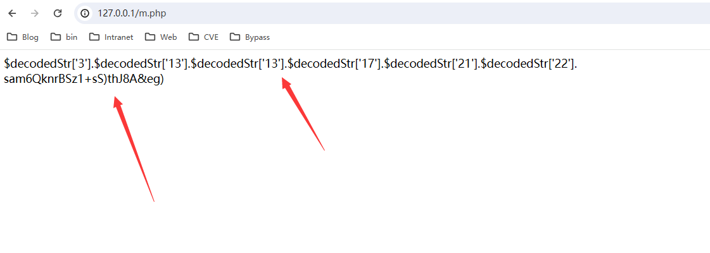
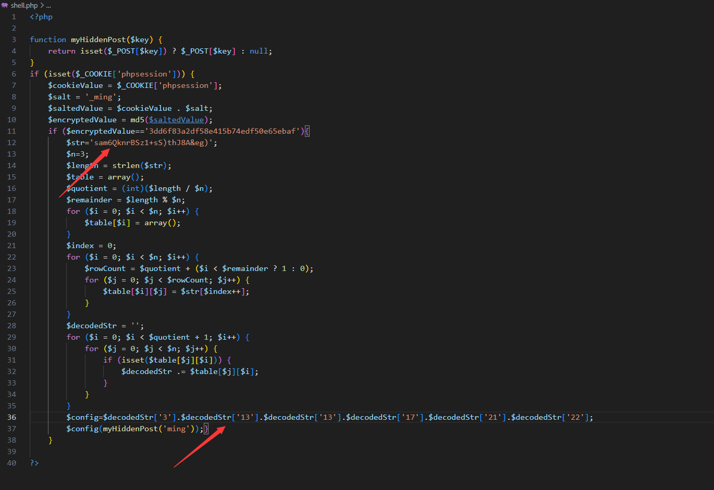
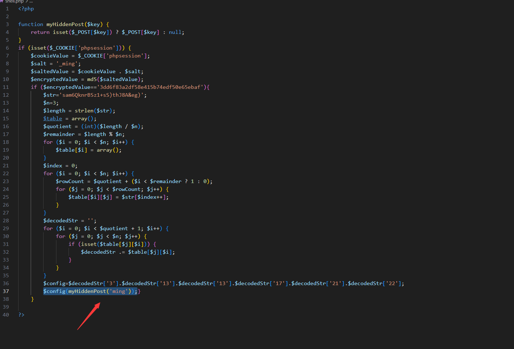
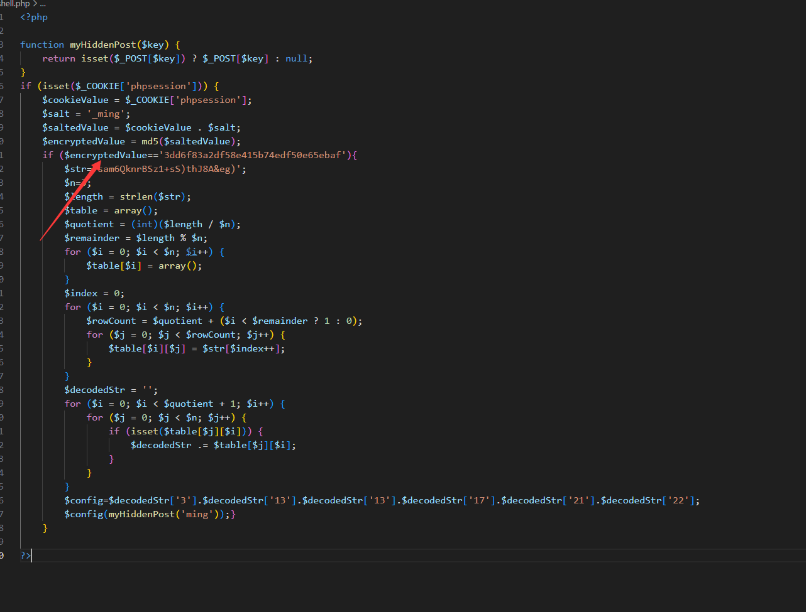
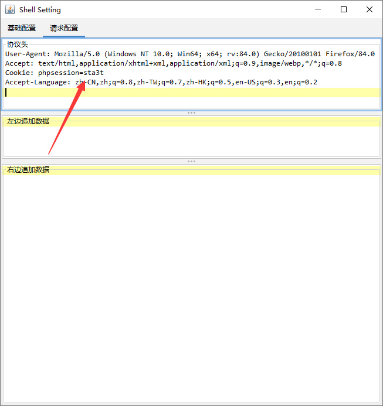
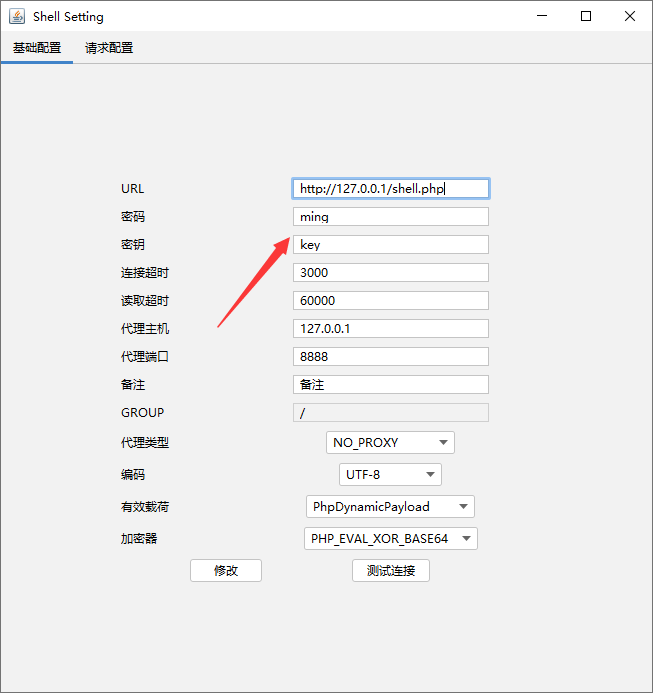
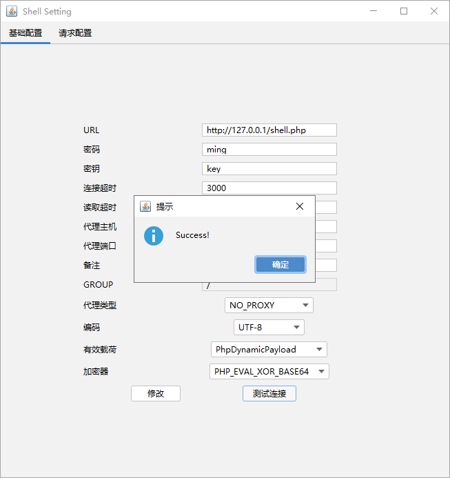
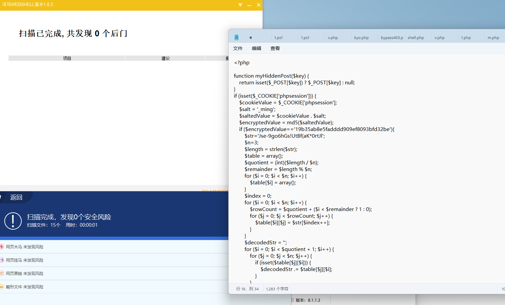

# Fence_php_horse
## 0x01 Ways

栅栏加密，采用拼接assert函数名的方式达到绕过

php版本有限制,在phpstudy环境下尝试只有php版本低于或者等于7.0.9才能使用

通过generate.php获取$config字段以及栅栏加密混淆的payload

替换$str字符串以及$config字符串

$config(myHiddenPost('ming'));设置了连接密码为ming，如果有需要请更改它

配置好即可用Godzilla连接

在代码中`$encryptedValue`的值可以自己设定，这里的值`3dd6f83a2df58e415b74edf50e65ebaf`是由`ming_sta3t`经过md5加密而来的，其中最后五个字符`_ming`是盐值。

## 0x02 Results

绕过河马以及安全狗

## 0x03 免责声明

本工具仅用于合法的授权安全测试和教育目的。未经授权访问或测试未授权的系统是非法的，会产生法律责任。 

本工具的作者概不负责任何非法或未经授权使用此工具所产生的后果。使用者承担使用本工具的全部责任。 
